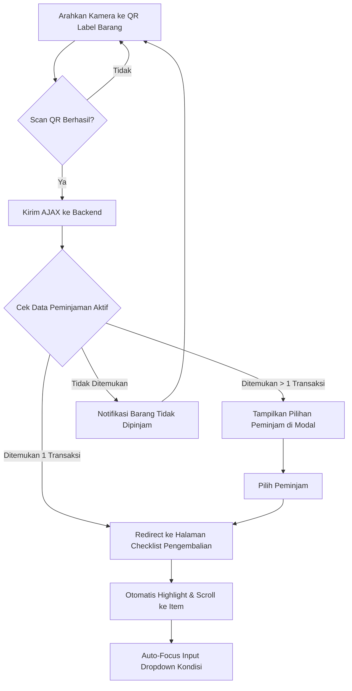

# Sistem Informasi Inventaris Laboratorium

Sistem Informasi Inventaris Laboratorium adalah platform berbasis web untuk mengelola aset, sirkulasi peminjaman, pengembalian barang, serta pelaporan stok secara realtime di laboratorium. Dirancang dengan antarmuka modern yang responsif dan dioptimalkan untuk performa tinggi.

Developed by : **Yoga Nugroho**  
WhatsApp     : **089685027530**  
Support      : [tako.id/YNGRHO](https://tako.id/YNGRHO)  
*Open Jasa Pembuatan Website & Joki Tugas Website*

<!-- Tombol Demo Website & Akses Kredensial -->
<p align="center">
  <a href="https://simlab.yobaseapp.me/"></a>
</p>

<p align="center">
  <code style="color: #FF5722; font-family: 'Courier New', Courier, monospace;">
  [!] WARNING: RESTRICTED ACCESS AREA<br>
  ADMIN: admin / admin123<br>
  STAFF: staff / staff123
  </code>
</p>

---
## Alur Sirkulasi Pengembalian (Scan QR Kamera)



---

## Fitur Utama Sistem

### 1. Tampilan Mobile & Desktop Responsif
* Menggunakan desain grid yang modern dengan utility class **Tailwind CSS**.
* **Sidebar Drawer khusus mobile**: menu disembunyikan secara otomatis di belakang tombol hamburger dengan overlay gelap, memberikan pengalaman mirip aplikasi Android/PWA.
* Dilengkapi PWA meta tags untuk menonaktifkan zoom otomatis dan memberikan status bar gelap yang rapi pada smartphone.

### 2. Real-time Camera QR Code Scanner
* **Pelacakan Cepat**: Scanner kamera realtime menggunakan library client-side `html5-qrcode` terintegrasi langsung di menu Pengembalian.
* **Scan & Temukan**: Arahkan label QR Code barang ke kamera di halaman utama pengembalian untuk langsung melacak siapa peminjamnya.
* **Beep Sound Feedback**: Dilengkapi notifikasi audio beep murni via HTML5 Web Audio API (beep bernada tinggi untuk sukses, buzz bernada rendah untuk gagal/error).
* **Auto-Highlight & Focus**: Setelah barang dideteksi di checklist, baris barang bersangkutan otomatis menyala hijau, ter-scroll ke tengah layar, dan kursor otomatis fokus ke dropdown kondisi.

### 3. Auto QR Code Generator & Label Print
* Setiap item yang dimasukkan ke sistem mendapatkan kode inventaris unik (misal: `LAB-001`).
* Sistem otomatis membuat gambar QR Code secara dinamis.
* Fitur **Cetak Label QR** siap cetak (print-ready popup) untuk dicetak sebagai stiker fisik dan ditempelkan pada barang.

### 4. Proteksi Hak Cipta & Anti-Maling (Anti-Theft)
Untuk melindung sistem dari duplikasi dan penyalahgunaan, platform ini dilengkapi script proteksi kuat:
* Menyembunyikan menu klik kanan (context menu disabled).
* Memblokir shortcut keyboard browser: `F12` (Developer Tools), `Ctrl+Shift+I`, `Ctrl+Shift+J`, `Ctrl+Shift+C`, `Ctrl+U` (View Source), dan `Ctrl+S` (Save Page).
* Mencegah seleksi teks (`user-select: none`) di seluruh halaman kecuali pada kolom input formulir.
* Mencegah aksi drag & drop pada gambar.

### 5. Dashboard Komprehensif & Multi-Role
* **Admin**: Pengelolaan penuh master data (Kategori, Lokasi Lab, Satuan Barang, Manajemen User), persetujuan peminjaman tertunda, notifikasi stok menipis, dan ekspor laporan terperinci.
* **Staff/Laboran**: Operasional harian sirkulasi peminjaman, scan pengembalian, dan riwayat aktivitas personal.
* **Timeline Aktivitas**: Audit trail log sistem terekam secara runtut.

---

## Arsitektur Basis Data

Sistem ini memiliki 10 tabel utama yang saling berelasi dengan integritas data transaksional (Rollback otomatis jika terjadi error saat transaksi sirkulasi):

| Nama Tabel | Deskripsi |
| --- | --- |
| `users` | Menyimpan kredensial pengguna (admin/staff/laboran). |
| `roles` | Menyimpan level hak akses sistem. |
| `categories` | Kategori pengelompokan barang (misal: Alat Ukur, Bahan Kimia, Elektronik). |
| `locations` | Lokasi penempatan fisik barang di lab. |
| `units` | Satuan takaran barang (misal: Pcs, Unit, Botol, Pack). |
| `items` | Detail data katalog barang, stok, status kondisi, dan batas minimum stok. |
| `borrowings` | Data utama transaksi peminjaman barang oleh peminjam (mahasiswa/dosen/umum). |
| `borrowing_details` | Rincian barang apa saja yang dipinjam, kuantitas, tanggal kembali, dan status fisik penerimaan. |
| `activity_logs` | Log histori aktivitas user untuk tujuan audit keamanan. |
| `settings` | Pengaturan variabel global sistem (seperti Nama Lab, Nama Aplikasi, dan Prefix QR). |

---

## Daftar Endpoint & Rute Navigasi

### Rute Umum (Public & Auth)
* `/login` : Formulir autentikasi masuk sistem.
* `/logout` : Menghapus sesi aktif dan keluar sistem.
* `/support-developer` : Halaman profil pengembang & open jasa joki.

### Rute Admin
* `admin/dashboard` : Halaman ringkasan statistik dan notifikasi sistem.
* `admin/users` : Manajemen akun laboran dan hak akses.
* `admin/categories` : CRUD kategori barang laboratorium.
* `admin/locations` : CRUD lokasi laboratorium fisik.
* `admin/units` : CRUD satuan barang.
* `admin/items` : CRUD katalog inventaris barang, cetak label QR, dan unggah foto.
* `admin/borrowings` : Daftar peminjaman aktif & persetujuan (Approve/Reject).
* `admin/returns` : Pengembalian barang & verifikasi scan QR kamera.
* `admin/reports` : Filter data transaksi sirkulasi dan export laporan excel/PDF.
* `admin/activity-logs` : Log audit sistem terlengkap.
* `admin/settings` : Kustomisasi nama lab dan konfigurasi prefix kode inventaris.

### Rute Staff / Laboran
* `staff/dashboard` : Ringkasan aktivitas operasional laboran.
* `staff/items` : Katalog melihat inventaris barang laboratorium yang tersedia.
* `staff/borrowings` : Mengajukan permohonan sirkulasi pinjam baru.
* `staff/returns` : Memproses pengembalian barang.
* `staff/profile` : Ubah biodata personal dan ganti kata sandi.

---

## Tech Stack
* **Core**: PHP 7.4+ (CodeIgniter 3 framework)
* **Database**: MySQL / MariaDB
* **Styling**: Tailwind CSS & Google Fonts (Inter)
* **Icons**: Lucide Icons CDN
* **Libraries**: `html5-qrcode` CDN (pemindai kamera)

---

## Instalasi & Konfigurasi

### 1. Persiapan Database
1. Buat database baru di MySQL dengan nama `inventarislab`.
2. Import file SQL database yang tersedia di root folder:
   ```bash
   mysql -u root -p inventarislab < database.sql
   ```

### 2. Konfigurasi CodeIgniter
Sesuaikan konfigurasi koneksi database Anda di file `application/config/database.php`:
```php
$db['default'] = array(
    'dsn'   => '',
    'hostname' => 'localhost',
    'username' => 'root', // Username database Anda
    'password' => '',     // Password database Anda
    'database' => 'inventarislab',
    'dbdriver' => 'mysqli',
    // ...
);
```

Atur URL utama web Anda di `application/config/config.php`:
```php
$config['base_url'] = 'http://localhost/inventarislab/'; // Sesuaikan dengan path server lokal Anda
```

### 3. Server Lokal (Laragon / XAMPP)
* Jika menggunakan virtual host (misal Laragon), akses situs melalui: `http://inventarislab.test`
* Atau gunakan built-in PHP server di root folder:
  ```bash
  php -S 127.0.0.1:8000 router.php
  ```
  lalu akses di browser: `http://127.0.0.1:8000`

---

## Akun Default (Siap Pakai)
Setelah instalasi selesai, masuk menggunakan akun bawaan berikut:

* **Administrator**:
  * Username: `admin`
  * Password: `admin123`
* **Staff / Laboran**:
  * Username: `staff`
  * Password: `staff123`

---

## Lisensi

Proyek ini dilisensikan di bawah **Creative Commons Attribution-NonCommercial 4.0 International (CC BY-NC 4.0)** - lihat file [LICENSE](LICENSE) untuk ketentuan detailnya.

* **Boleh**: Digunakan untuk keperluan pribadi, pembelajaran, tugas akademis, dan dikembangkan/dimodifikasi lebih lanjut.
* **Dilarang**: Diperjualbelikan, didistribusikan ulang untuk komersial, atau diklaim sebagai milik pribadi untuk keuntungan materi tanpa izin tertulis dari pengembang asli.

Dikembangkan oleh **Yoga Nugroho**.
